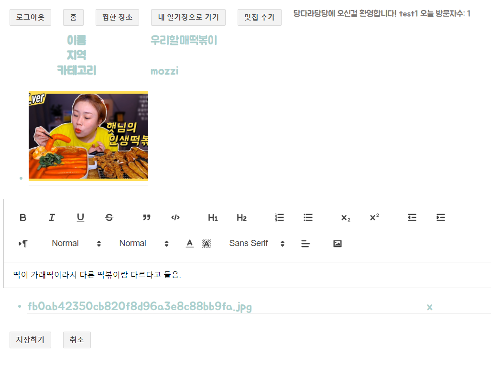

홈화면

 
[현재 aws 배포 서버](http://15.152.18.84:3000/) 
[swagger](http://15.152.18.84:9000/swagger-ui/)

이메일: user
패스워드 : password 
로 로그인 가능

<h3>구현기능</h3>
 
* 회원 관리
  
1) 로그인
    * json web token 을 이용해서 회원 정보 저장 / 확인  
    * 세션과 쿠키에 저장 (Redis 연계)
    * vee-validate 사용
    
   

2) 로그아웃
    * 세션과 쿠키 삭제 (Redis 연계)

3) 구글 로그인 연동 완성  
  
* 배너

1) 추천기능
    * 추천수를 바탕으로 자신이 찜한 가게들과 비슷한 카테고리를 모아 추천
  
2) 검색기능
    * 가게를 유투버 이름과 가게이름으로 검색 가능

3) 일기장 기능
    * 에디터 적용 
    * vue3-quill 사용

* 장소 

1) 찜 / 추천 기능
    * 추천한 것은 상단의 배너에 있는 찜한 장소에서 확인 가능
    * Pageable 을 이용하여 페이징 처리

2) 추가 / 수정 기능
    * 배너에서 확인 가능
    * 사용자는 추가/수정 가능
    * 관리자는 추가/수정/삭제 가능
    * 역할은 세션으로 구분
    
3) 댓글 (파일 추가)
    * 파일을 추가할 수 있음.  
    * 자신이 쓴 댓글만 수정/삭제 가능
    * 10초마다 리뷰 리프레시

* 일기장
        

1) 에디터
    * vue3-quill 이용
    
2) 파일 저장
    * 여러개 저장 가능
       
       
* 로그 확인
    * Interceptor 사용

* 배포
    * 현재 mariadb, redis - 아마존 웹서비스 이용해서 띄움.
    * nginx 로 연결

* 서버 설치완료된 것.
    * java,
    * redis,
    * mariadb,
    * vue
    * nginx

    
<h3>앞으로 해야할 기능들</h3>

* 프론트단 수정
* 테스트코드 집어넣기
* jwt token
* 서버 - 파일 위치 바꾸기
* 구글 로그인

