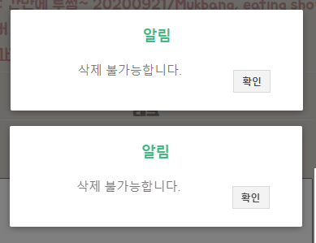
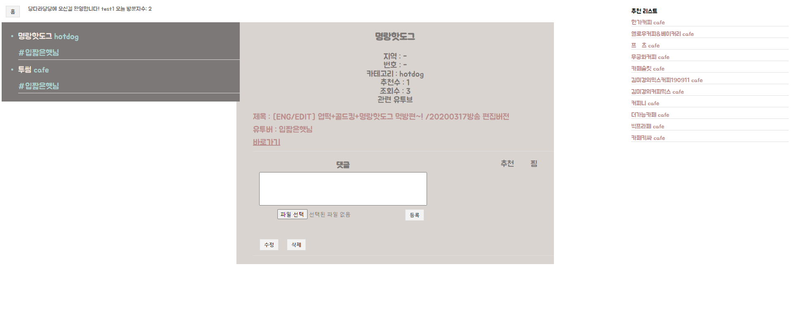

구현기능
-  
* 로그인 
> json web token 을 이용해서 회원 정보 저장 / 확인
> 세션과 쿠키에 저장
* 로그아웃
> 세션과 쿠키 삭게

* 댓글 (파일 추가)
> 파일을 추가할 수 있음.  
> 자신이 쓴 댓글만 수정/삭제 가능
> 10초마다 리뷰 리프레시
>
*  추천기능
> 추천수를 바탕으로 자신이 찜한 가게들과 비슷한 카테고리를 모아 추천
* 검색기능
> 가게를 유투버 이름과 가게이름으로 검색 가능

* 찜 / 추천 기능
> 추천한 것은 상단의 찜한 장소에서 확인 가능

앞으로 해야할 기능들
-
* 프론트단 수정중... 
* 도커로 무중단 배포
